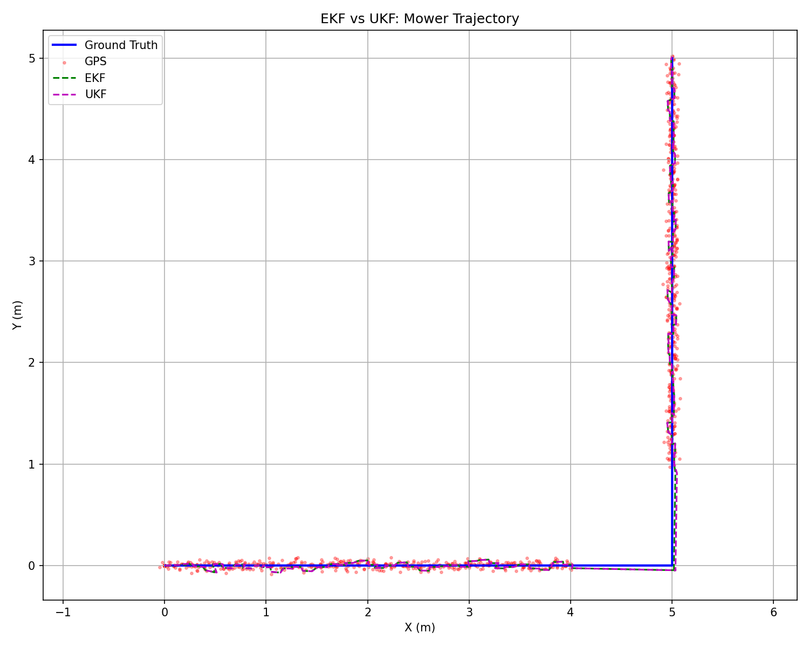

# Kalman-Mower

EKF and UKF implementations for 2D robot localization using simulated IMU and RTK data, written in C++ with Eigen library.

## Problem Description

A robotic lawn mower running on a predefined path. Two sensors are available:

- **IMU** : acceleration and angular velocity.
- **RTK-GPS** (lower freq.): high accuracy position, but signal lost at corner

The goal is to fuse these two sensors to get accurate position estimates, especially during GPS outages.

## Motion Model

**State vector:**

```math
x =
\begin{bmatrix}
x \\
y \\
\psi \\
v
\end{bmatrix}
```

where $x$, $y$ are position, $\psi$ is heading (yaw), and $v$ is linear velocity.

**Motion model:**

```math
\begin{aligned}
x_k &= x_{k-1} + v \cos(\psi_{k-1}) \Delta t \\
y_k &= y_{k-1} + v \sin(\psi_{k-1}) \Delta t \\
\psi_k &= \psi_{k-1} + \omega \Delta t \\
v_k &= v_{k-1} + a \Delta t
\end{aligned}
```

**Observation model (GPS measures position directly):**
```math
z = Hx =
\begin{bmatrix}
1 & 0 & 0 & 0 \\
0 & 1 & 0 & 0
\end{bmatrix}
\begin{bmatrix}
x \\ y \\ \psi \\ v
\end{bmatrix}
=
\begin{bmatrix}
x \\ y
\end{bmatrix}
```

---

## EKF (Extended Kalman Filter)

Linearizes the motion model using the Jacobian.

### Predict

**State propagation** — apply nonlinear function f(x, u):

```math
\bar{x} = f(x, u)
```

**Jacobian** $F = \frac{\partial f}{\partial x}$ :

```math
F = \begin{bmatrix}
1 & 0 & -v \sin(\psi) \Delta t & \cos(\psi) \Delta t \\
0 & 1 & v \cos(\psi) \Delta t & \sin(\psi) \Delta t \\
0 & 0 & 1 & 0 \\
0 & 0 & 0 & 1
\end{bmatrix}
```

**Covariance matrix:**

```math
\bar{P} = F P F^\top + Q
```

### Update (every GPS step, 10 Hz, when available)

**Innovation:**

```math
y = z - H \bar{x}
```

**Covariance:**

```math
S = H \bar{P} H^\top + R
```

**Kalman gain:**

```math
K = \bar{P} H^\top S^{-1}
```

**State update:**

```math
\hat{x} = \bar{x} + K y
```

**Covariance update:**

```math
\hat{P} = (I - K H) \bar{P}
```
---

## UKF (Unscented Kalman Filter)

Instead of linearizing the function, the UKF approximates the probability distribution using sigma points.

### Parameters
```math
\begin{aligned}
n &= 4 & & \text{(state dimension)} \\
\lambda &= \alpha^2(n + \kappa) - n \\
\alpha &= 0.001 & & \text{(spread of sigma points)} \\
\beta &= 2 & & \text{(optimal for Gaussian)} \\
\kappa &= 0
\end{aligned}
```

### Weights
```math
\begin{aligned}
W_m^{(0)} &= \frac{\lambda}{n + \lambda} & & \text{(mean weight, center point)} \\
W_c^{(0)} &= \frac{\lambda}{n + \lambda} + (1 - \alpha^2 + \beta) & & \text{(covariance weight, center point)} \\
W_m^{i} &= \frac{1}{2(n + \lambda)} & & \text{(all other points, } i = 1..2n\text{)}
\end{aligned}
```

### Predict

**Step 1 — Generate 2n+1 = 9 sigma points:**

```math
\begin{aligned}
L &= \text{cholesky}\left((n + \lambda) P\right) \\
\boldsymbol{\sigma}_0 &= \bar{x} \\
\boldsymbol{\sigma}_i &= \bar{x} + L_i & & (i = 1 \ldots n) \\
\boldsymbol{\sigma}_{i+n} &= \bar{x} - L_i & & (i = 1 \ldots n)
\end{aligned}
```

L is the lower triangular matrix from Cholesky decomposition. Each column of L defines the direction and distance of sigma points from the mean.

**Step 2 — Propagate each sigma point through the nonlinear model:**

```math
\boldsymbol{\sigma}_i^* = f(\boldsymbol{\sigma}_i, u) \quad i = 0 \ldots 2n
```

Each sigma point goes through the same motion model (with its own yaw value), so different points experience different cos/sin transformations.

**Step 3 — Recover predicted mean and covariance:**
```math
\begin{aligned}
\bar{x} &= \sum_{i=0}^{2n} W_i^{(m)} \boldsymbol{\sigma}_i^* \\
\bar{P} &= \sum_{i=0}^{2n} W_i^{(c)} (\boldsymbol{\sigma}_i^* - \bar{x})(\boldsymbol{\sigma}_i^* - \bar{x})^\top + Q
\end{aligned}
```

### Update

Since the GPS observation model is linear (H just selects x and y from the state), the update step is the same as EKF. If the observation model were nonlinear, sigma points would also be used in the update step.

---

## Sensor Simulation

The data generator creates a ground truth trajectory and simulates sensor readings:

- **Trajectory**: straight 5m → right turn 90° (3s, ω = π/6 rad/s) → straight 5m
- **IMU noise**: white noise on acceleration (σ = 0.1 m/s²) and gyroscope (σ = 0.01 rad/s)
- **GPS noise**: Gaussian noise on position (σ = 0.03 m, simulating RTK-GPS)
- **GPS dropout**: configurable time window where GPS signal is lost (default: 4–9 seconds)

---

## Results



- **Blue**: ground truth trajectory
- **Red dots**: GPS measurements (absent during dropout period)
- **Green dashed**: EKF estimate
- **Purple dotted**: UKF estimate

During normal operation, both filters closely track the true trajectory. During GPS dropout, the filters rely on IMU, which drifts due to sensor noise. When GPS signal recovers, both filters quickly converge back to the true position.

---

## Build and Run

### Prerequisites

- C++17 compiler
- CMake ≥ 3.14
- Eigen3
- Python 3 with numpy and matplotlib (for visualization)

### Build and Run

```bash
mkdir build && cd build
cmake .. && make
cd ..
mkdir -p data
./build/kalman-mower
python3 scripts/plot.py data/ekf_output.csv data/ukf_output.csv
```

Or simply:

```bash
./run.sh
```

---

## Project Structure

```
kalman-mower/
├── CMakeLists.txt
├── README.md
├── run.sh
├── src/
│   ├── main.cpp              # Data generation + EKF/UKF loop
│   ├── data_generator.h/cpp  # Trajectory and sensor simulation
│   ├── ekf.h/cpp             # Extended Kalman Filter
│   └── ukf.h/cpp             # Unscented Kalman Filter
├── scripts/
│   └── plot.py               # Visualization
└── data/                     # Generated at runtime (gitignored)
```